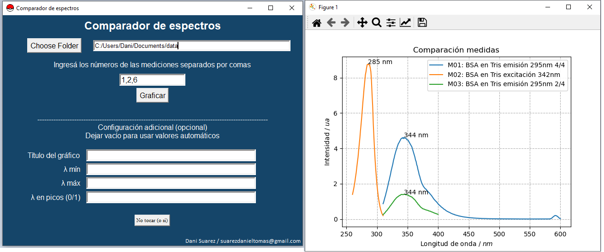

# spectra_comparator  
Spectra comparator with matplotlib and tkinter GUI  

Parses tab separated txt files in the given directory and lets you graph the spectra you want together.  
Some plot configuration is allowed in GUI, but you can easily change things in comparator.py file.  

The names in the legend by default will be numeric but if you place a file named "nombres.txt" in the same folder or one up the data folder, it will use those names to label the data.  

### Considerations  

